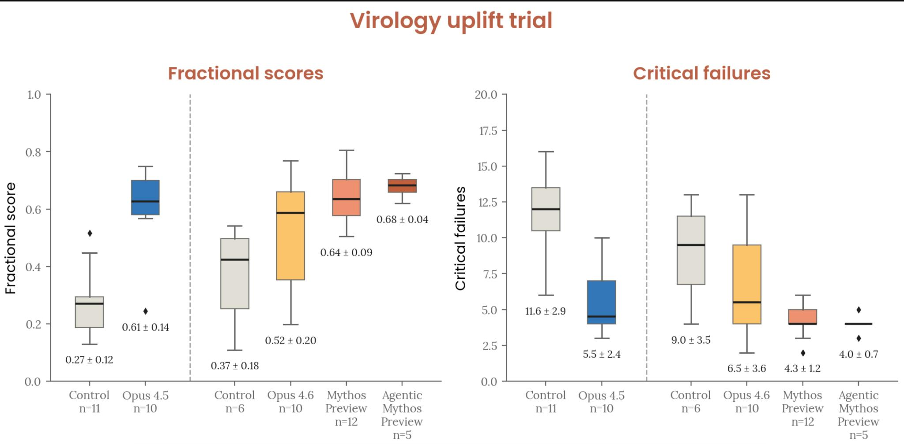
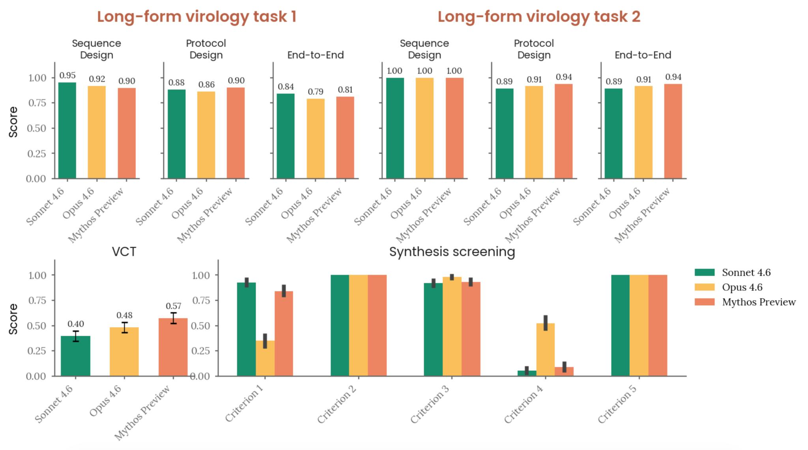

# Mythos PDF — Side-by-Side Parser Comparison

> "In my experience there are approx. one thousand different pdf converters that are all equally terrible for anything except the simplest documents. Post the converted Mythos pdf, figures, tables and all. If good, happy to retweet as this is essential and missing infrastructure." — Andrej Karpathy

This directory contains the output of seven PDF-to-Markdown converters run against the same 245-page document: [Anthropic's Claude Mythos System Card](https://www-cdn.anthropic.com/53566bf5440a10affd749724787c8913a2ae0841.pdf).

The canonical Nutrient CLI output is one level up: [`../anthropic-claude-mythos-system-card.md`](../anthropic-claude-mythos-system-card.md).

## TL;DR

**The free heuristic CLI is already competitive with the best open-source tools, and 75× faster.** The premium Python SDK adds what none of them can: every figure and chart, extracted losslessly.

| | Free CLI | Python SDK | docling | pymupdf4llm | markitdown | pypdf |
|---|---:|---:|---:|---:|---:|---:|
| Runtime | **1.19s** | 53s | 89s | 17.7s | 40.9s | 8.1s |
| Headings | 265 | 265 | 287 | 258 | 0 | 0 |
| Table rows | 398 | 398 | 420 | 422 | 0 | 0 |
| **Figures extracted** | 0 | **110** | 0 | 0 | 0 | 0 |
| Cost | Free | Free trial | Free | Free | Free | Free |

## The two Nutrient tiers

1. **[Free CLI](..)** — the `pdf-to-markdown` binary in this repo. Heuristic extraction, no ML models, MIT-free for up to 1,000 docs/month. Wins on speed and produces clean markdown tables and headings.

2. **[Python SDK](https://pypi.org/project/nutrient-sdk/)** (`nutrient-sdk` v1.0.4) — the premium engine with OCR, ICR, Vision, and image extraction. Everything the CLI does, plus every figure in the document rendered to an actual image file.

Both are backed by the same 20-year-old document engine (formerly PSPDFKit). The CLI is what you reach for when you need fast, correct markdown. The SDK is what you reach for when "figures, tables, and all" is literally what you need.

## Qualitative spot-check: one table, one figure

### Table 6.3.A — Capability Evaluation Summary

The main benchmark comparison table on page 188. Claude Mythos Preview vs Claude Opus 4.6 vs GPT-5.4 vs Gemini 3.1 Pro across SWE-bench, GPQA, MMMLU, USAMO, HLE, etc.

**Nutrient CLI:**
```markdown
|Evaluation|Claude Mythos Preview|Claude Opus 4.6|Other GPT-5.4|Gemini 3.1 Pro|
|---|---|---|---|---|
|SWE-bench Verified|93.9%|80.8%|-|80.6%|
|SWE-bench Pro|77.8%|53.4%|57.7%|54.2%|
|SWE-bench Multilingual|87.3%|77.8%|-|-|
|SWE-bench Multimodal|59%|27.1%|-|-|
|Terminal-Bench 2.0*|82%|65.4%|75.1%|68.5%|
|GPQA Diamond|94.5%|91.3%|92.8%|94.3%|
```
Every cell correct. Clean markdown.

**docling:**
```markdown
| Evaluation             | Claude family         | Claude family   | Other models   | Other models   |
|------------------------|-----------------------|-----------------|----------------|----------------|
|                        | Claude Mythos Preview | Claude Opus 4.6 | GPT-5.4        | Gemini 3.1 Pro |
| SWE-bench Verified     | 93.9%                 | 80.8%           | -              | 80.6%          |
```
Correct data, but docling renders the merged-cell header as two rows with repeated "Claude family" / "Other models" labels. Downstream LLMs will fumble on the extra header row. docling also handles sub-rows like HLE / no-tools / with-tools as nested rows, which is *more faithful* to the visual layout but harder for agents to parse.

**pymupdf4llm, markitdown, markit-ai, liteparse, pypdf:**
Missed the table entirely. The benchmark numbers appear as flat prose in the surrounding paragraphs. No structured recovery possible.

### Figure 2.2.5.2.A — Virology Uplift Trial (page 28)

A two-panel box-plot figure showing fractional scores and critical failures across Control, Opus 4.5, Opus 4.6, Mythos Preview, and Agentic Mythos conditions. This is exactly the kind of chart that makes PDFs hard.

**Nutrient Python SDK:**



Complete figure extracted as a standalone image file (108KB JPEG). All labels, error bars, and values preserved. The LLM can literally see the chart when asked "what were the results of the virology uplift trial."

**Nutrient CLI, docling, pymupdf4llm, markitdown, markit-ai, liteparse, pypdf:**
All seven produced the caption text *(e.g., "Figure 2.2.5.2.A] Virology Uplift Trial. The Claude Mythos Preview-assisted group achieved a mean score of 4.3 critical failures...")* but none extracted the actual figure. docling at least leaves an `<!-- image -->` placeholder; the rest give nothing.

If Karpathy asks Claude "what was the range of critical failures in the virology trial," every parser except the Nutrient SDK forces the LLM to guess from the caption alone. The SDK hands the LLM the actual chart.

### Figure 2.2.5.4.A — CB-1 Automated Evaluations (page 30)



Same story. A complex three-panel results figure. Only the Python SDK recovered the image itself.

## Structural extraction — raw counts on all 245 pages

| Parser | Size | Headings | Table rows | Lists | Figures | Runtime |
|---|---:|---:|---:|---:|---:|---:|
| **nutrient CLI** | 453 KB | 265 | 398 | 231 | 0 | **1.19s** |
| **nutrient SDK (Python)** | 453 KB | 265 | 398 | 231 | **110** | 53s¹ |
| [docling](https://github.com/docling-project/docling) | 520 KB | 287 | 420 | 284 | 0 | 89s |
| [pymupdf4llm](https://github.com/pymupdf/PyMuPDF) | 466 KB | 258 | 422 | 273 | 0 | 17.7s |
| [markit-ai](https://github.com/Michaelliv/markit) | 447 KB | 2 | 0 | 13 | 0 | 1.44s |
| [markitdown](https://github.com/microsoft/markitdown) | 451 KB | 0 | 0 | 13 | 0 | 40.9s |
| [liteparse](https://www.npmjs.com/package/@llamaindex/liteparse) | 480 KB | 0 | 0 | 13 | 0 | 2.05s |
| [pypdf](https://github.com/py-pdf/pypdf) | 560 KB | 0 | 0 | 0 | 0 | 8.1s |

¹ _SDK runtime includes decoding and re-encoding every extracted figure as a base64 PNG. The underlying extraction is comparable to the CLI._

Only three parsers produced usable markdown structure: **nutrient** (CLI + SDK), **docling**, and **pymupdf4llm**. The other four collapsed into flat prose.

Only **one** parser produced actual figure images: **nutrient SDK**.

## Files in this directory

| File | Parser | Version | Notes |
|---|---|---|---|
| [`anthropic-claude-mythos-nutrient-sdk.md`](anthropic-claude-mythos-nutrient-sdk.md) | nutrient-sdk (Python) | 1.0.4 | + 110 figures in [`figures/`](figures) |
| [`anthropic-claude-mythos-docling.md`](anthropic-claude-mythos-docling.md) | docling | 2.86.0 | |
| [`anthropic-claude-mythos-pymupdf4llm.md`](anthropic-claude-mythos-pymupdf4llm.md) | pymupdf4llm | 1.27.2.2 | |
| [`anthropic-claude-mythos-markitdown.md`](anthropic-claude-mythos-markitdown.md) | markitdown[pdf] | 0.1.5 | |
| [`anthropic-claude-mythos-markit.md`](anthropic-claude-mythos-markit.md) | markit-ai | 0.2.0 | |
| [`anthropic-claude-mythos-liteparse.md`](anthropic-claude-mythos-liteparse.md) | @llamaindex/liteparse | latest | |
| [`anthropic-claude-mythos-pypdf.md`](anthropic-claude-mythos-pypdf.md) | pypdf | 6.9.2 | |

The canonical **nutrient CLI** output (what the free `pdf-to-markdown` binary produces) is in the parent directory: [`../anthropic-claude-mythos-system-card.md`](../anthropic-claude-mythos-system-card.md)

## Reproducing this comparison

```bash
# Input
curl -o mythos.pdf https://www-cdn.anthropic.com/53566bf5440a10affd749724787c8913a2ae0841.pdf

# Nutrient free CLI (this repo)
npx @pspdfkit/pdf-to-markdown mythos.pdf anthropic-claude-mythos-system-card.md

# Nutrient Python SDK (premium — figures, tables, OCR, ICR, Vision)
pip install nutrient-sdk
python3 -c "
import nutrient_sdk as ns
from nutrient_sdk import Document, MarkdownExporter
ns.initialize_sdk()
doc = Document.open('mythos.pdf')
doc.export('nutrient-sdk.md', MarkdownExporter())
"

# Comparison parsers
pip install pypdf pymupdf4llm "markitdown[pdf]" liteparse docling
npm install -g markit-ai @llamaindex/liteparse

python3 -c "from pypdf import PdfReader; open('pypdf.md','w').write('\n---\n'.join(p.extract_text() or '' for p in PdfReader('mythos.pdf').pages))"
python3 -c "import pymupdf4llm; open('pymupdf4llm.md','w').write(pymupdf4llm.to_markdown('mythos.pdf'))"
python3 -c "from markitdown import MarkItDown; open('markitdown.md','w').write(MarkItDown().convert('mythos.pdf').text_content)"
python3 -c "from liteparse import LiteParse; open('liteparse.md','w').write(LiteParse().parse('mythos.pdf', ocr_enabled=False).text or '')"
python3 -c "from docling.document_converter import DocumentConverter; open('docling.md','w').write(DocumentConverter().convert('mythos.pdf').document.export_to_markdown())"
npx markit-ai mythos.pdf -q -o markit.md
```

## What we learned

1. **Most "PDF to markdown" tools are just PDF-to-text tools wearing a hat.** Half the parsers tested (markitdown, pypdf, markit-ai, liteparse) produced zero markdown structure on a 245-page document. For RAG, these are strictly worse than just piping `pdftotext` output into your prompt.

2. **The free CLI in this repo is not a toy.** It matches docling and pymupdf4llm on structural extraction and beats both on speed by 15–75×. For 99% of agent workflows, it's all you need — and it's free.

3. **Figures are the thing every free tool misses.** Even the top three (nutrient CLI, docling, pymupdf4llm) all produced zero actual images on this document. If your pipeline needs the charts — benchmark results, architecture diagrams, training loss curves — the free tier won't get you there.

4. **The premium SDK closes the figure gap cleanly.** 110/110 figures from the Mythos PDF extracted as real image files, in place, adjacent to their captions. That's what "figures, tables, and all" actually looks like.
