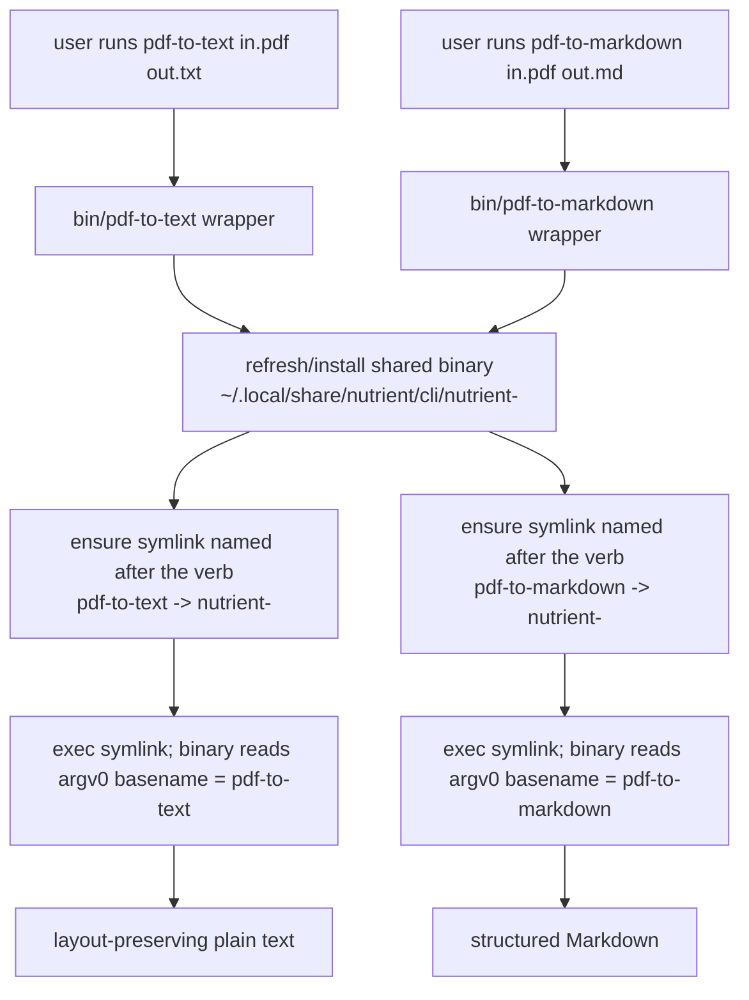

# feat: Add pdf-to-text as a first-class CLI entrypoint

## Summary

Add a `pdf-to-text` command alongside `pdf-to-markdown`, both backed by the same multi-call `nutrient` 1.1.0 CDN binary (which dispatches its verb from `argv[0]`'s basename). Wire the new command through the npm package and the shell installer, and document the two commands as peers plus a light mention of `self-update`. The full benchmark refresh is **deferred** — it is gated on new `pdf-to-text` benchmark runs (ParseBench + the jdrhyne QA bench) and is out of this plan.

---

## Problem Frame

The `nutrient` 1.1.0 binary that this repo's wrapper now downloads is multi-call: it exposes three verbs (`pdf-to-markdown`, `pdf-to-text`, `self-update`) and selects one from the basename of `argv[0]` (busybox-style), falling back to `pdf-to-markdown` when invoked under any non-verb name. The repo currently ships only the `pdf-to-markdown` command and documents only that verb, so the new layout-preserving `pdf-to-text` capability is unreachable through the installed CLI and absent from the docs.

`pdf-to-text` is a distinct deliverable, not a flag: because the verb is chosen by the invocation's basename, reaching it requires a second entrypoint with the right name — a packaging change, not a documentation line. Fiona (the upstream source of this wrapper) already ships `pdf-to-markdown` and `pdf-to-text` as separate skills, each with its own wrapper that pins the verb via an `argv[0]` symlink. This plan brings the same two-command shape into this standalone repo.

The CLI is **not** broken today: the current wrapper execs the platform binary under its `nutrient-<platform>` name, which the binary resolves to the default `pdf-to-markdown` verb. This plan makes the markdown verb explicit (symmetry with the new command, and no reliance on the undocumented default) while adding the text verb.

---

## Requirements

- **R1** — A `pdf-to-text` command is installable and runnable via all three documented install paths (npm global, npx, curl/`install.sh`, and clone), producing layout-preserving plain text.
- **R2** — `pdf-to-text` and `pdf-to-markdown` share one downloaded binary and one update/cache lifecycle; installing one does not duplicate or conflict with the other.
- **R3** — The README and usage docs present the two commands as peers, including a short "when to use which" section, mirroring fiona's framing.
- **R4** — `self-update` is documented lightly (mentioned, not promoted as a primary command), with a note that the wrapper already auto-refreshes the binary, so the two updaters don't surprise users.
- **R5** — The package version is bumped for this feature release and the CHANGELOG records the new command.
- **R6** — No change to the benchmark section's numbers, framing, version labels, or competitor rows (deferred — see Scope Boundaries).

---

## Key Technical Decisions

### KTD1 — Reach `pdf-to-text` via an `argv[0]` symlink, mirroring fiona

The binary dispatches its verb from `basename(argv[0])` when that basename matches a known verb. The new `bin/pdf-to-text` wrapper installs/updates the shared binary exactly as the markdown wrapper does, then ensures a `pdf-to-text` symlink points at the platform binary and `exec`s the symlink — so the binary sees `pdf-to-text` as its verb. This is the proven upstream pattern (fiona `plugins/pdf-to-text/skills/pdf-to-text/bin/pdf-to-text`). Rationale: it requires no new flags, no binary changes, and keeps each command's behavior independently auditable.

### KTD2 — Two explicit wrapper files, not one shared dispatcher

Ship `bin/pdf-to-markdown` and `bin/pdf-to-text` as two near-identical scripts differing only in the verb/symlink name (and `self-update` passes through either). Rationale: this mirrors the authoritative fiona layout, keeps each command's script greppable and independently reviewable, and avoids a clever single-script-dispatches-on-its-own-basename indirection. The cost is ~230 lines of duplicated wrapper logic across the two files; this is vendored install/update infra that changes rarely and tracks upstream, so the duplication is accepted.

**Alternative considered:** one shared wrapper that derives its verb from `basename "$0"` with both npm `bin` names pointing at the single file. DRYer, but introduces a file whose name no longer matches the command, complicates the `install.sh` raw-URL fetch path, and diverges from the upstream reference. Rejected for this iteration; revisit if the wrapper logic starts changing often.

### KTD3 — Harden the markdown wrapper to pin its verb explicitly

Update `bin/pdf-to-markdown` to use the same explicit `argv[0]`-symlink approach (`pdf-to-markdown` symlink → platform binary, then `exec`) rather than exec-ing the binary under its `nutrient-<platform>` name and relying on the default-to-markdown fallback. Rationale: symmetry with the new command and independence from the binary's undocumented default-verb behavior, which could change. Low risk — output is identical today; verified the binary converts correctly under both a `pdf-to-markdown`-basename symlink and the platform name.

### KTD4 — Defer the entire benchmark refresh

Leave the benchmark section (numbers, speed callouts, framing, the `1.0.1` version label, the opendataloader-hybrid row) untouched. Rationale: the user is running new `pdf-to-text`-specific benchmarks (ParseBench + the jdrhyne QA bench) before the numbers and positioning are restated; doing it now would be thrown away. Recorded under Deferred to Follow-Up Work.

---

## High-Level Technical Design

Verb dispatch — how one binary serves both commands via the invocation name:

*Directional — the shared cache directory and refresh cadence follow the existing wrapper; this conveys the dispatch shape, not exact paths.*

---

## Implementation Units

### U1. Add the `pdf-to-text` wrapper and pin the markdown wrapper's verb

**Goal:** Provide a `bin/pdf-to-text` entrypoint that dispatches the `pdf-to-text` verb, and update `bin/pdf-to-markdown` to pin its verb via the same symlink mechanism.

**Requirements:** R1, R2 (partial), and the mechanism behind R3.

**Dependencies:** none.

**Files:**
- `bin/pdf-to-text` (new) — wrapper mirroring `bin/pdf-to-markdown`, with the verb symlink/`exec` targeting `pdf-to-text`.
- `bin/pdf-to-markdown` (modify) — switch the final `exec` to the explicit `pdf-to-markdown`-symlink form (KTD3).

**Approach:** Mirror the upstream fiona wrappers (KTD1/KTD2). Both scripts keep the existing CDN resolution, install, cache, and 6-hour refresh logic unchanged; only the final dispatch block differs — ensure a verb-named symlink next to the shared platform binary, then `exec` it so `argv[0]` carries the verb. Keep the shared cache/state location identical across both wrappers so R2 holds (one binary, one lifecycle).

**Patterns to follow:** fiona `plugins/pdf-to-text/skills/pdf-to-text/bin/pdf-to-text` and `plugins/pdf-to-markdown/skills/pdf-to-markdown/bin/pdf-to-markdown` (the `VERB_LINK` block). The existing `bin/pdf-to-markdown` in this repo for the install/refresh scaffolding.

**Test scenarios** (shell wrappers — verify via `sh -n` syntax check plus smoke runs against a sample PDF):
- `sh -n bin/pdf-to-text` and `sh -n bin/pdf-to-markdown` pass.
- Running `bin/pdf-to-text sample.pdf out.txt` writes non-empty layout-preserving text (columns stay spatially separated).
- Running `bin/pdf-to-markdown sample.pdf out.md` still writes structured Markdown (regression — output unchanged from current behavior).
- `bin/pdf-to-text sample.pdf` (no output arg) streams text to stdout; `bin/pdf-to-markdown sample.pdf` streams Markdown to stdout.
- Batch form: `bin/pdf-to-text ./indir ./outdir` writes one `.txt` per input PDF.
- Both commands resolve to the **same** cached binary directory (assert only one `nutrient-<platform>` binary is downloaded after invoking both).
- Verb isolation: `pdf-to-text` output is plain text (no Markdown `#`/table pipes); `pdf-to-markdown` output contains Markdown structure — confirming `argv[0]` dispatch is correct.

**Verification:** Both commands run from the repo checkout against a sample PDF and produce their respective formats from a single shared binary install.

### U2. Wire `pdf-to-text` into the package and shell installer

**Goal:** Make `pdf-to-text` install and run through npm (global + npx) and through `install.sh` (curl and clone), at parity with `pdf-to-markdown`.

**Requirements:** R1, R2.

**Dependencies:** U1.

**Files:**
- `package.json` (modify) — add `"pdf-to-text": "bin/pdf-to-text"` to `bin`; extend the `check` script to also `sh -n ./bin/pdf-to-text`; confirm `files` still covers the new wrapper (the `bin` directory entry already does).
- `install.sh` (modify) — install both wrappers into `INSTALL_DIR` (local-copy path when run from a clone, and raw-URL download path when curled), preserving the existing PATH hint and `chmod`.

**Approach:** The npm `bin` map gains the second command; npm creates the `pdf-to-text` shim on install. `install.sh` generalizes its single-target copy/download to handle both `pdf-to-markdown` and `pdf-to-text` (loop or explicit second target), keeping the existing curl/wget fallback and idempotent behavior. No rename of the existing wrapper file or raw URL (avoids breaking existing installs and the documented curl path).

**Patterns to follow:** the existing single-target logic in `install.sh`; the existing `bin`/`files`/`scripts` shape in `package.json`.

**Test scenarios:**
- `npm pack --dry-run` (the `pack:dry-run` script) lists both `bin/pdf-to-markdown` and `bin/pdf-to-text`.
- `npm run check` passes with both `sh -n` checks.
- From a clone, `./install.sh` installs both commands into `~/.local/bin` (or `INSTALL_DIR`) and both are executable.
- `install.sh` run a second time is idempotent (overwrites cleanly, no error).
- Simulated curl path (`RAW_BASE_URL` reachable, no local `bin/`): both wrappers download and install.
- After a global `npm install`, both `pdf-to-markdown` and `pdf-to-text` are on PATH and self-report usage.

**Verification:** Each install path yields two working commands sharing one binary.

### U3. Document both commands and `self-update`

**Goal:** Present `pdf-to-text` and `pdf-to-markdown` as peers in the README and usage docs, add a "when to use which" section, and mention `self-update` lightly.

**Requirements:** R3, R4.

**Dependencies:** U1 (behavior must exist before it is documented as available).

**Files:**
- `README.md` (modify) — add `pdf-to-text` to the install/usage sections and a short "pdf-to-text vs pdf-to-markdown" subsection; add a brief `self-update` note; reflect that the CLI exposes both verbs. Do **not** touch the Benchmarks section (R6).
- `docs/distribution-model.md` (modify) — note that the package now ships two wrappers backed by one binary, if the current text enumerates the shipped surface.

**Approach:** Mirror fiona's `pdf-to-text` SKILL.md framing for the "when to use which" guidance (plain-text/grep/column-alignment consumers → `pdf-to-text`; structure-benefiting/RAG consumers → `pdf-to-markdown`). For `self-update`, a one- to two-sentence note: the binary supports `self-update`, but the wrappers already auto-refresh every 6 hours, so manual self-update is rarely needed (R4 — mention, don't promote). Keep all benchmark numbers and framing exactly as-is.

**Patterns to follow:** fiona `plugins/pdf-to-text/skills/pdf-to-text/SKILL.md` ("When to use this vs. pdf-to-markdown"); the existing README usage/voice.

**Test scenarios:** *Test expectation: none — documentation only.* Manual review: both commands appear in install + usage, the "when to use which" section reads cleanly, the `self-update` note doesn't read as a primary command, and the Benchmarks section is byte-for-byte unchanged.

**Verification:** README presents two peer commands; a reader can pick the right one and knows `self-update` exists without being pushed to it.

### U4. Version bump, changelog, and packaging verification

**Goal:** Record the feature release and verify the package is shippable.

**Requirements:** R5.

**Dependencies:** U1, U2, U3.

**Files:**
- `package.json` (modify) — bump `version` (feature release, e.g. minor bump from `0.2.2`); the exact number follows the repo's release convention.
- `CHANGELOG.md` (modify) — add an entry for the new `pdf-to-text` command and the markdown-wrapper hardening.

**Approach:** Single release-prep unit. Follow the existing CHANGELOG format and the repo's release-branch convention (changes land via a release/fix branch → PR, per the merged-PR history). State plainly that benchmarks are unchanged this release.

**Test scenarios:**
- `npm pack --dry-run` succeeds and the tarball contains both wrappers, README, LICENSE, `install.sh`, and the `docs/*.md` listed in `files`.
- `npm run check` passes.
- CHANGELOG entry matches the prior entries' shape.

**Verification:** `npm pack --dry-run` produces a clean tarball with both commands; CHANGELOG and version reflect the feature.

---

## Scope Boundaries

**In scope:** the `pdf-to-text` command, the markdown-wrapper verb hardening, packaging/installer parity, peer documentation, a light `self-update` mention, and the version/changelog bump.

### Deferred to Follow-Up Work
- **Benchmark refresh (the whole section).** Restated accuracy/speed numbers, the lead-with-what framing, the `1.0.1 → 1.1.0` version label in the benchmark tables, and the opendataloader-hybrid row. Gated on new `pdf-to-text` benchmark runs against **ParseBench** and the **jdrhyne QA bench**, plus the already-measured opendataloader numbers. Tracked as a separate effort/PR.
- **Per-command benchmark positioning for `pdf-to-text`** — once the ParseBench/QA-bench results exist, decide whether `pdf-to-text` gets its own comparison in the docs.

### Out of Scope
- Windows support (remains "coming soon").
- Renaming the package or repo (`@pspdfkit/pdf-to-markdown` stays; it simply gains a second command).
- Any change to the `nutrient` binary or the upstream fiona repo.
- The OpenClaw `nutrient-pdf` plugin (separate repo, already shipped).

---

## Risks & Dependencies

- **Dual-updater confusion (low).** The wrapper's own 6-hour auto-refresh coexists with the binary's `self-update` verb. Mitigated by R4's framing (mention, don't promote) and the shared cache/state location (U1) so both paths converge on one binary.
- **Installer drift (low).** `install.sh` must keep curl and clone paths at parity for two targets; covered by U2 test scenarios for both paths and idempotency.
- **Wrapper duplication (accepted).** Two near-identical scripts (KTD2) raise the cost of future wrapper changes; accepted because the logic tracks upstream and changes rarely. Single-dispatcher refactor is the documented fallback if that assumption breaks.
- **Dependency:** the deferred benchmark work depends on external benchmark runs (ParseBench, jdrhyne QA bench) the user owns; this plan does not block on them.

---

## Sources & Research

- Upstream wrappers (authoritative pattern): fiona `plugins/pdf-to-text/skills/pdf-to-text/bin/pdf-to-text`, `plugins/pdf-to-markdown/skills/pdf-to-markdown/bin/pdf-to-markdown` (the `VERB_LINK` `argv[0]`-symlink dispatch block).
- Upstream framing: fiona `plugins/pdf-to-text/skills/pdf-to-text/SKILL.md` ("When to use this vs. pdf-to-markdown").
- Binary behavior verified this session: `nutrient` 1.1.0 from `agent-cdn.nutrient.io/pdf-to-markdown/LATEST` (`20260617T131130Z`) exposes `pdf-to-markdown`, `pdf-to-text`, `self-update`; dispatches verb from `argv[0]` basename and defaults to `pdf-to-markdown` under non-verb names. `--enable-image-export` confirmed on `pdf-to-markdown`.
- This repo's current packaging: `package.json` (`bin`, `files`, `check`/`pack:dry-run` scripts), `install.sh` (curl/wget + clone install into `~/.local/bin`), `bin/pdf-to-markdown` (CDN resolve + refresh + `exec`).
